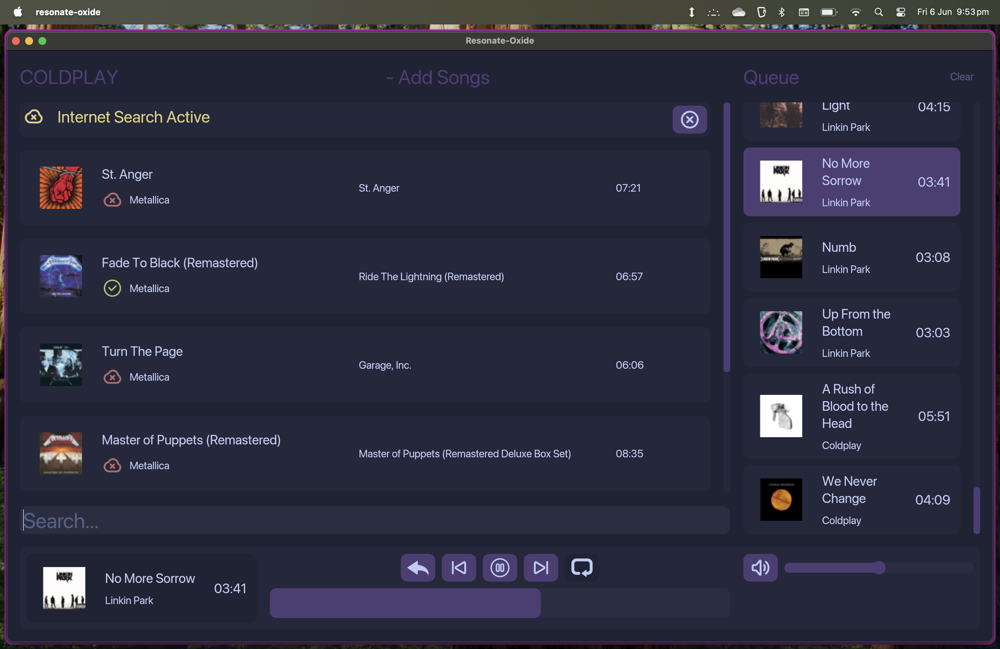

# Resonate-Oxide
- Fast, rust powered music app integrating Spotify and Youtube Music
- Runs asynchronously on the iced runtime
- Full featureset for use as a complete music app, including offline playback

# FEATURES
- Searching Youtube music for songs
- Caching all search results, even those that are unused for faster searches later
- Asynchronous thumbnail downloading for the UI for all search results
- Playlist Management
  - Create
  - Delete
  - Edit Name
  - Add and remove songs, regardless of download status
  - Mass download songs in a single playlist
  - Search within playlist
- Download songs asynchronously with a queueing system to not choke bandwidth
  - 5 at a time, customised by settings which are not yet available for user to change
  - Queue the rest with a callback to start them downloading when space is available
- Complete Audio backend and frontend
  - Queueing of songs
  - Ability to jump around in queue via mouse and skip buttons
  - Add and remove songs from queue
  - Shuffle a playlist into the queue
  - Progress bar
  - Automatic queue pushing when audio sink is empty
  - GUI showing progress bar
  - Volume controls
- Shuffling and playing and queue management, including interactive display and clearing functionality
- Spotify API integration to import public playlists (optional feature)
- Full user control of processes including notification of failure, most commonly from networking
  - Show status of a youtube search process
  - Show status of song downloads
  - Show status of youtube authentication with an interactable notifcation allowing retrying
 
# FUTURE FEATURES
- [x] YouTube integration
- [x] Spotify integration
- [ ] Last.FM integration (SCROBBLING)
- [ ] Discord RPC

 

